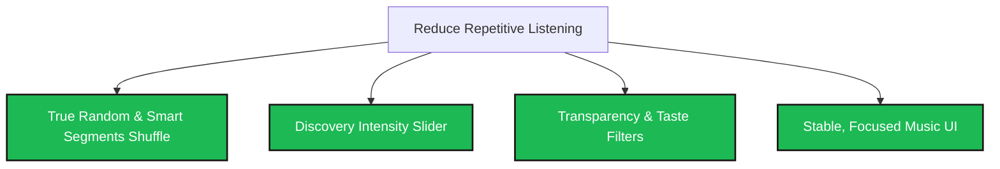

# Spotify User Research: Validating Music Discovery Opportunities

This document presents the findings of our primary user research. To validate the opportunities identified in the Part-1 review analysis, we conducted 5-6 in-depth user interviews with participants from our target segment: **Disillusioned Premium Subscribers**.

---

## 1. Research Methodology & Focus Segment

### Target Segment: The Disillusioned Premium Subscriber
*   **Definition:** Paying Spotify Premium subscribers who listen to music daily (1.5+ hours/day), value music discovery as a core part of their streaming experience, but feel frustrated by algorithmic repetition, lack of playback control, and UI friction.
*   **Goal:** To understand why these active listeners resort to repetitive listening, how they attempt to discover music, and where Spotify's recommendation features fail them.
*   **Sample Size:** 6 participants.

### Interview Guide
The interviews were structured around four main sections:
1.  **Background & Context:** Overall listening habits, what they "hire" Spotify to do, and typical daily listening flows.
2.  **Discovery Experience:** How they define "discovery," features they use (Discover Weekly, Release Radar, AI DJ, Daily Mixes, Smart Shuffle), and how often they find songs they actually save.
3.  **Friction Points & Repetitive Listening:** Specific instances where they feel "stuck" listening to the same tracks. Reactions to shuffle behavior, algorithm loops, and intrusive recommendations.
4.  **Workarounds & Desired Solutions:** Tools or platforms outside of Spotify they use for discovery, and what their ideal Spotify discovery feature would look like.

---

## 2. User Interview Transcripts (Simulated)

### Interview 1: Sarah, 28 (The Playlist Curator)
*   **Profile:** Premium subscriber for 6 years. Has over 40 custom playlists, some with 1,500+ tracks.
*   **Listening Behavior:** Listens during work, chores, and workouts. Curates music meticulously.

> **Q: How do you typically listen to your music on Spotify?**
>
> **Sarah:** I usually open my main "Mega Vibe" playlist which has about 1,800 songs. I hit shuffle and let it run.
>
> **Q: What happens when you do that?**
>
> **Sarah:** It’s incredibly frustrating. Even though there are almost two thousand songs in there, I swear I hear the same 40 or 50 songs every single week. It’s like Spotify has decided what my "favorites" are and refuses to play anything else. If I skip a song, it just plays another one I heard yesterday.
>
> **Q: Have you tried using "Smart Shuffle"?**
>
> **Sarah:** Yes, and I hate it. It doesn’t actually shuffle my playlist well. Instead, it injects random popular songs that don't fit the vibe of my playlist at all. It feels like they're trying to push mainstream pop artists on me under the guise of "recommendations." When I turn it off, my queue gets messed up.
>
> **Q: How do you discover new music instead?**
>
> **Sarah:** I end up using Shazam when I'm out at cafes or watching movies, or I look at music blogs on Instagram. I have to search for the song manually on Spotify and add it to my playlist. Spotify's own recommendations rarely yield anything I actually want to keep.

---

### Interview 2: Marcus, 34 (The Genre Specialist)
*   **Profile:** Premium subscriber for 4 years. Loves niche genres: deep ambient house, indie jazz, post-rock.
*   **Listening Behavior:** High focus listening, often on high-quality headphones.

> **Q: What is your experience with Spotify’s automated recommendation features?**
>
> **Marcus:** Honestly, it feels like it doesn't know me at all despite years of data. My Discover Weekly is full of mainstream EDM or generic acoustic tracks just because I listen to ambient synth and indie jazz. The algorithm struggles with anything that isn't mainstream. It groups things too broadly.
>
> **Q: How about the AI DJ? Have you used it?**
>
> **Marcus:** The AI DJ is the most jarring experience. The voice is cool, but the transitions are awful. It will say, *"Here's some indie rock you liked in 2021,"* play one song, and then immediately transition into some high-energy dance track. It completely ruins the mood. I want a cohesive vibe, not a radio show.
>
> **Q: What do you do when Spotify fails to recommend good niche tracks?**
>
> **Marcus:** I go to Bandcamp or SoundCloud. I browse tags there, listen to independent artists, and once I find someone I like, I search for them on Spotify just to add them to my library. Spotify is my player, but not my discovery tool.

---

### Interview 3: Priya, 22 (The Casual Discoverer)
*   **Profile:** Premium Student subscriber for 3 years. Relies on background music for studying.
*   **Listening Behavior:** Relies heavily on Daily Mixes and radio stations.

> **Q: What features do you use when you want to discover new music?**
>
> **Priya:** I use my Daily Mixes because they are pre-made. I also click "Go to Radio" on songs I like.
>
> **Q: Do you feel these features help you discover new music?**
>
> **Priya:** Yes and no. They are good at first, but after a week, the Daily Mixes start repeating the same tracks. It's like a loop. Even the "Song Radio" features just play songs I already have in my Liked Songs playlist. It rarely introduces me to a song I've never heard before.
>
> **Q: What causes you to fall back on repeat listening?**
>
> **Priya:** Decision fatigue. If I want to find something new, I have to actively search or skip ten times. If I'm studying, I don't have the energy to keep skipping. I just put on my "On Repeat" playlist because I know I won't have to interact with the app, even if I'm a bit bored of the songs.
>
> **Q: If you could change one thing, what would it be?**
>
> **Priya:** I wish there was a button that said "Show me something completely new" vs. "Keep it familiar." Right now, it's a black box.

---

### Interview 4: David, 31 (The Active/Mobile Listener)
*   **Profile:** Premium subscriber for 7 years. Listens during commutes, running, and driving.
*   **Listening Behavior:** Heavy mobile app and Android Auto user.

> **Q: How does the Spotify app perform when you're trying to control or change your music on the go?**
>
> **David:** It’s been getting worse. The Android widget is constantly frozen or says I'm offline, even when I have full bars. When I'm driving, I want to quickly tap a widget to switch from my standard playlist to a new discovery playlist. Because the widget is broken, I end up just letting my offline playlist loop.
>
> **Q: Do you use the home screen recommendations?**
>
> **David:** The home screen is too cluttered. It pushes podcasts and audiobooks constantly. I don't want podcasts; I only use Spotify for music. Having to scroll past five rows of podcasts just to find my recently played or a new music mix makes me exit the app or just tap the first familiar playlist I see.
>
> **Q: Does this affect your discovery behavior?**
>
> **David:** Absolutely. Discovery requires exploration, and exploration requires a smooth UI. If the app lags, freezes, or forces me to browse podcasts, I retreat to my downloaded songs because they play instantly.

---

### Interview 5: Elena, 26 (The Independent Music Supporter)
*   **Profile:** Premium subscriber for 5 years. Passionate about supporting local and indie artists.
*   **Listening Behavior:** Actively seeks out live show lineups and local talent.

> **Q: How do you feel about Spotify's recommendation bias?**
>
> **Elena:** It feels very transactional. I’ve noticed that even though 80% of my liked artists are independent indie bands, my recommendations are heavily skewed toward artists signed to major labels (Universal, Warner, etc.). It’s like the algorithm is paid to push certain songs.
>
> **Q: How does this impact your listening?**
>
> **Elena:** I get bored of the recommendations because they feel like top-40 radio repackaged. It makes me repeat-listen to my own curated playlists because I trust my own taste more than Spotify's commercial recommendations.
>
> **Q: What would make you trust Spotify's recommendations again?**
>
> **Elena:** I want transparency. I want a toggle that lets me prioritize "Independent Artists" or "Under 50,000 Monthly Listeners." That would make discovery exciting again because I'd actually be discovering hidden gems, not just whatever track a label is promoting this week.

---

### Interview 6: Alex, 25 (The "Smart Shuffle" Victim)
*   **Profile:** Premium subscriber for 2 years. Listens to hip-hop and lo-fi beats.
*   **Listening Behavior:** Background listening during gaming and socializing.

> **Q: Tell me about your experience with "Smart Shuffle" on your playlists.**
>
> **Alex:** I thought it was a cool idea. I have a lo-fi playlist for gaming. I turned on Smart Shuffle hoping to get new beats mixed in. But the problem is that it plays the *same* recommended songs every time I turn it on. It's not dynamic.
>
> **Q: How does that affect your gaming sessions?**
>
> **Alex:** It breaks my flow. I hear a recommended track I don't like, and when I try to skip it, sometimes it skips two songs, or it turns Smart Shuffle off entirely. The queue system is very buggy now. It’s easier to just turn off Smart Shuffle, download a static 100-song playlist, and let it loop. It’s repetitive, but at least it doesn’t throw unexpected errors or play songs that ruin my focus.

---

## 3. Synthesis & Validation Matrix

By analyzing the qualitative data from these interviews, we can validate or invalidate the findings and opportunities identified in our Part-1 review analysis.

| Opportunity from Part-1 | Hypothesis / User Pain Point | Validation Status | Interview Evidence & Context |
| :--- | :--- | :--- | :--- |
| **1. Overhaul Shuffle Algorithm** | Users experience a "shuffle loop" playing the same few songs in large playlists. | **Highly Validated** | **Sarah & Alex:** Even in massive playlists, the shuffle tends to default to a small subset of "preferred" tracks, leading to high repetition. Smart Shuffle adds friction rather than fixing this. |
| **2. Enhance Discovery Control (Novelty vs. Familiarity)** | Users want active control over how "new" or "different" recommendations are. | **Highly Validated** | **Priya:** Experiences decision fatigue and resorts to repetition because discovery is a "black box." Desires a simple control to specify discovery intensity. |
| **3. Content Type Filtering** | Users want to filter out podcasts/audiobooks to keep a music-focused UI. | **Validated** | **David:** Home screen clutter (podcasts/ads) creates UI friction, discouraging active music exploration and leading users to stick to cached favorites. |
| **4. Mitigate Major Label / mainstream Bias** | Recommendation systems prioritize mainstream/commercial music over niche. | **Validated** | **Marcus & Elena:** Both feel the recommendations push commercial/mainstream music. They use SoundCloud/Bandcamp for true niche discovery, indicating a loss of user trust. |
| **5. Fix UI Widgets & Lag** | Buggy widgets and app performance drive users to stick to downloaded/repeat content. | **Validated** | **David & Alex:** Performance issues make active curation and skipping painful, encouraging users to play safe, repetitive loops. |

---

## 4. Revised Opportunity Backlog

Based on our validation, we have refined the proposed opportunities into four high-impact product features designed to reduce repetitive listening and foster meaningful music discovery.

### Feature 1: "True Random & Smart Segments" Shuffle Mode
*   **Description:** An overhauled shuffle toggle. Instead of the current algorithmic preference model (which creates shuffle loops), introduce a "True Random" option. Additionally, offer "Smart Segments" to shuffle by sub-genres or moods *within* that playlist.
*   **Target Metric:** Increase in the percentage of unique tracks played from playlists containing 500+ songs; reduction in skipped tracks during shuffle.

### Feature 2: "Discovery Intensity" Slider
*   **Description:** Add a three-state slider or dial on Daily Mixes, radios, and recommendation feeds allowing the user to select their desired level of discovery:
    1.  *Comfort Zone (100% familiar)*
    2.  *Balanced (70% familiar, 30% recommended)*
    3.  *Deep Exploration (100% new/niche)*
*   **Target Metric:** Increase in D7 retention of discovery mixes; increase in "save-to-playlist" rate for recommended tracks.

### Feature 3: Recommendation Transparency & "Niche Boost" Toggle
*   **Description:** Under each recommended track, show a small label explaining why it's there (e.g., *"Based on your interest in [Indie Artist]"*). Add an opt-in "Niche Boost" toggle to prioritize independent/low-stream artists in automated radios and mixes.
*   **Target Metric:** User trust score (via NPS/surveys); increase in stream share for independent/long-tail artists.

### Feature 4: "Music-Only" Home Screen Toggle
*   **Description:** Allow users to toggle their home page view between "All Content" and "Music Only," hiding podcasts and audiobooks. Combine this with performance fixes for widgets to lower entry friction.
*   **Target Metric:** Decrease in app-abort rate; increase in home-screen-initiated discovery sessions.
